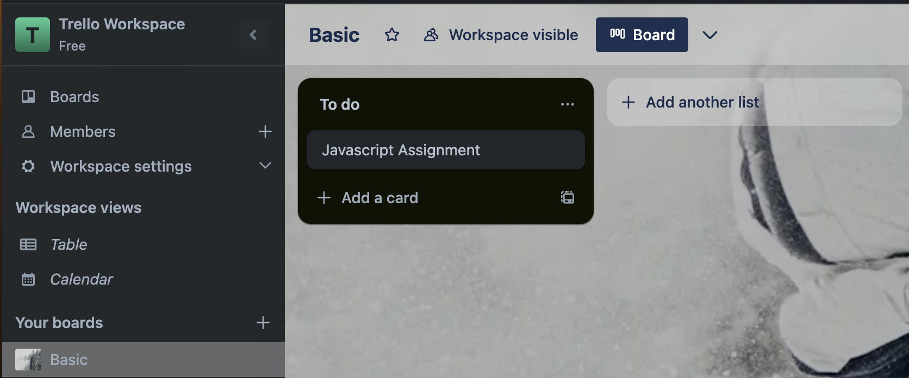
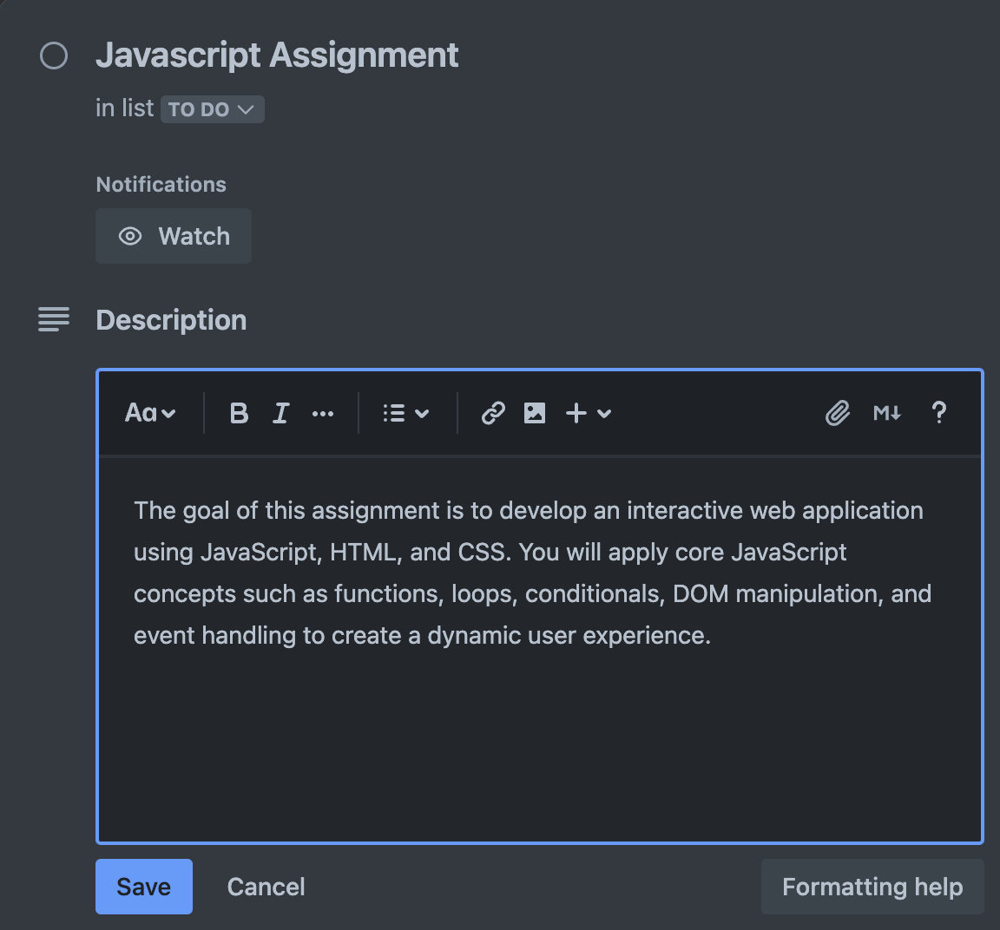
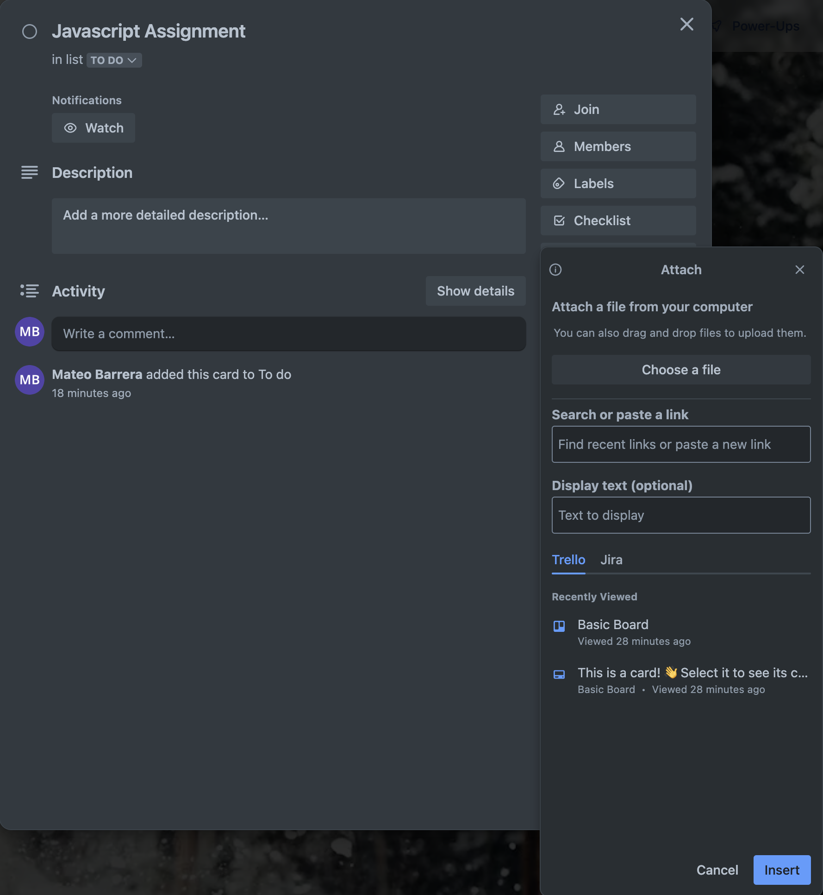

# How to Add and Manage Trello Cards  

## Overview  
In Trello, **cards** represent individual tasks, ideas, or work items. They are the **core unit** of project management in Trello.

!!! note "What Are Trello Cards?"
    
    Trello cards act like Nigital Sticky Notes where you can assign tasks, track progress, and collaborate with team members.

---

## Step 1: Creating a New Card  
1. Open a **Trello board** where you want to create a card.  
2. Choose a **list** where the card should be placed.  
3. Click **Add a card** at the bottom of the list.  
4. Type the **task name** in the input box.  
5. Click **Add card** to create the card.  

*Creating a new Trello card by entering a task name and clicking 'Add card'.*

---

## Step 2: Customizing a Card  
After creating a card, click on it to open the **Card Details View**, where you can:  
**Add a description** – Provide details or instructions for the task.  
**Attach files** – Upload images, PDFs, or documents.  
**Create a checklist** – Break tasks into smaller steps.  
**Set due dates** – Ensure deadlines are visible.  
**Add labels** – Categorize tasks for easy filtering.  

*Customizing a Trello card by adding descriptions, attachments, and due dates.*  

!!! warning "Don't Forget Due Dates!"
    
    If a task has a STRICT deadline, always set a DUE date so it doesn’t get overlooked.  
    Trello **only sends reminders** if a due date is set.

---

## Conclusion  
You now know how to **create, customize, assign, and organize** Trello cards effectively.
