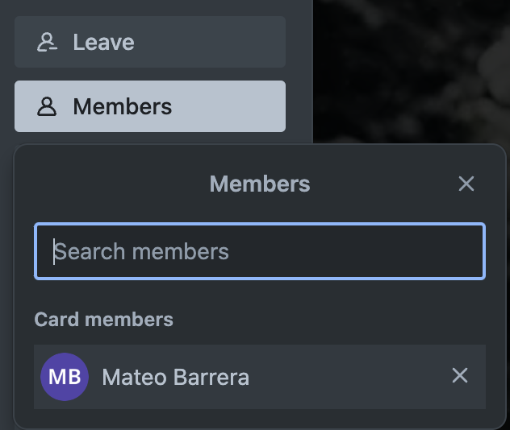
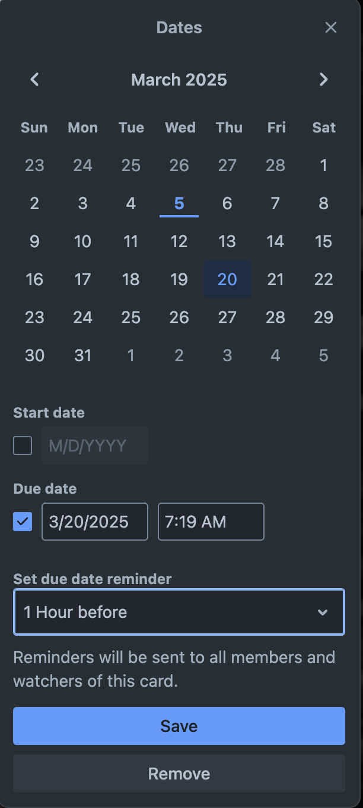

# How to Assign Members and Set Due Dates in Trello  

## Overview  
Assigning team members to Trello cards ensures that **everyone knows their responsibilities**, while setting due dates helps **keep projects on schedule**.

!!! note "Why Assign Members?"
    
    Assigning members to a Trello card ensures tasks don’t get IGNORED.  
    The assigned user gets notified and can track their responsibilities.

---

## Step 1: Assign Members to a Card  
1. Open a **Trello board** and navigate to the card you want to assign.  
2. Click on the **card** to open its detailed view.  
3. Click the **"Members"** button on the right-hand side.  
4. Select a team member from the list or search for their name.  
5. Click on the member’s name to assign them to the card.  

*Assigning a team member to a Trello card.*  

!!! success "Team Collaboration Made Easy"
    
    Once a member is assigned, they receive a Trello 🔔notification.  
    They will also see their assigned tasks under their profile.

---

## Step 2: Set a Due Date  
1. Click the **"Due Date"** button in the card’s detailed view.  
2. Select a **date and time** for the deadline.  
3. Click **"Save"** to confirm.  
4. (Optional) Enable **"Set Reminder"** to receive a notification before the due date.  

*Setting a due date and enabling reminders for a Trello card.*  

!!! warning "⏳ Missed Deadlines Can Cause Delays!"
    
    If no due date is set, tasks might be forgotten or completed late.  
    Always set a realistic deadline for time-sensitive work.

---

## Conclusion  
By assigning members and setting due dates, you **improve accountability** and **ensure tasks are completed on time**.
