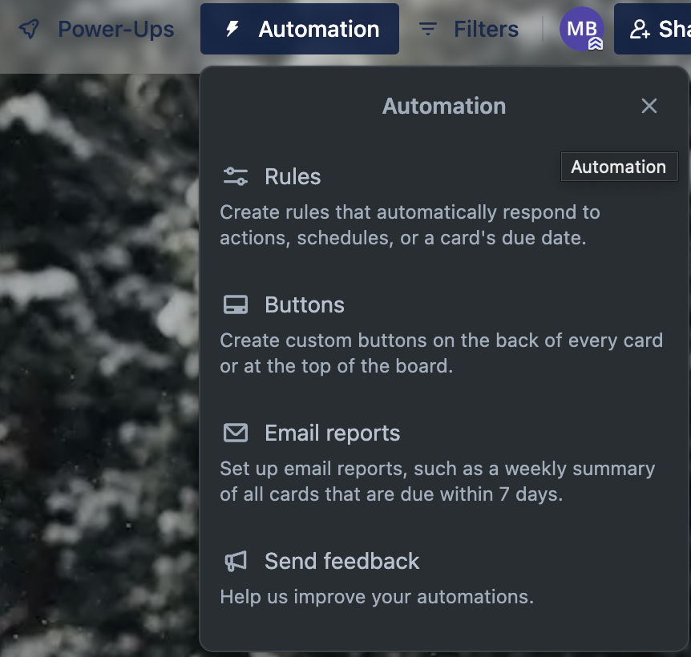

# How to Automate Tasks with Butler in Trello  

## Overview  
**Butler** is Trello’s built-in automation tool that helps users **save time by automating repetitive tasks**.

!!! note "What is Butler?"

    Butler is Trello’s automation assistant that allows you to create rules, triggers, and actions without coding.

---

## Step 1: Enable Butler on Your Trello Board  
1. Open your Trello board.  
2. Click on **"Automation"** (⚡ Butler icon) in the board menu.  
3. Select **"Rules"** from the automation menu.  
4. Click **"Create Rule"** to set up your first automation.  

*Opening the Butler Automation panel in Trello.*  

---

## Conclusion  
Butler in Trello **saves time and reduces manual work**. By setting up **rules and buttons**, you can automate your workflow.
