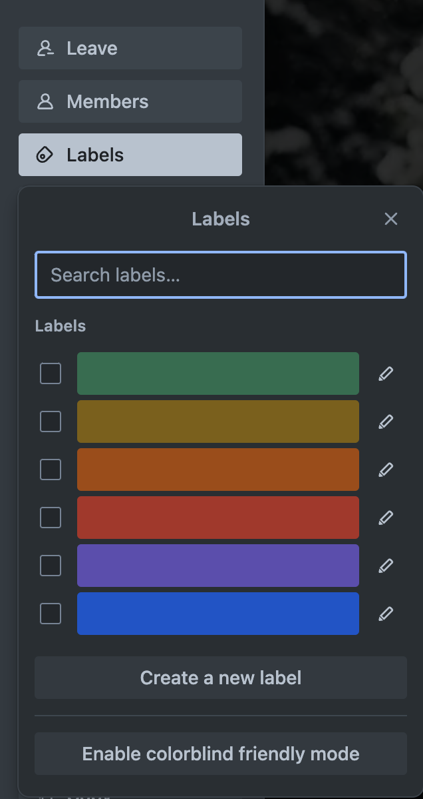

# How to Use Labels and Filters in Trello  

## Overview  
Labels and filters in Trello help you **categorize tasks**, **prioritize work**, and **quickly find specific cards**. Labels add **color-coded tags** to cards, while filters allow you to view only the tasks that match specific criteria.

!!! note "Why Use Labels?"
    
    Labels make it easier to identify **task priorities** at a glance.  
    Example:  
    🔴 RED → Urgent  
    🟡 YELLOW → In Progress  
    🟢 GREEN → Completed  

---

## Step 1: Adding a Label to a Card  
1. Open a **Trello board** and navigate to a card.  
2. Click on the card to open its detailed view.  
3. Click the **Labels** button in the right-hand menu.  
4. Choose an existing label or click **Create a new label**.  
5. Name the label (e.g., "High Priority," "Waiting on Review") and select a color.  
6. Click **Save** to apply the label.  

*Applying a new label to a Trello card.*  

---

## Conclusion  
Using labels and filters makes Trello **more organized and easy to navigate**.
