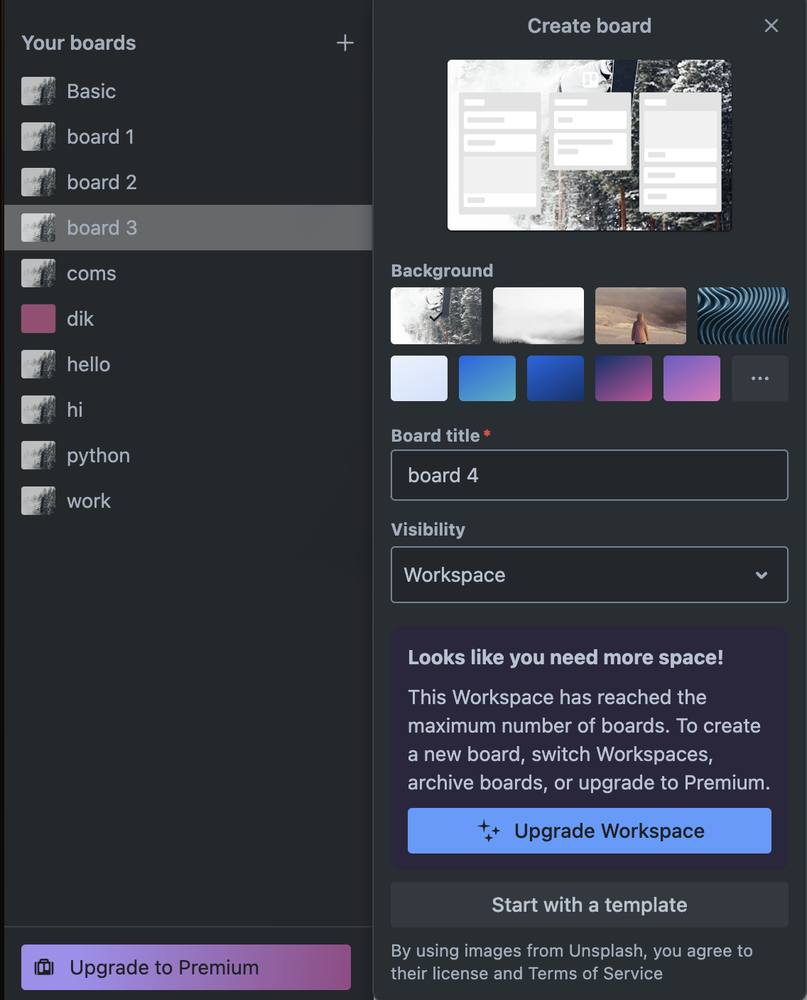
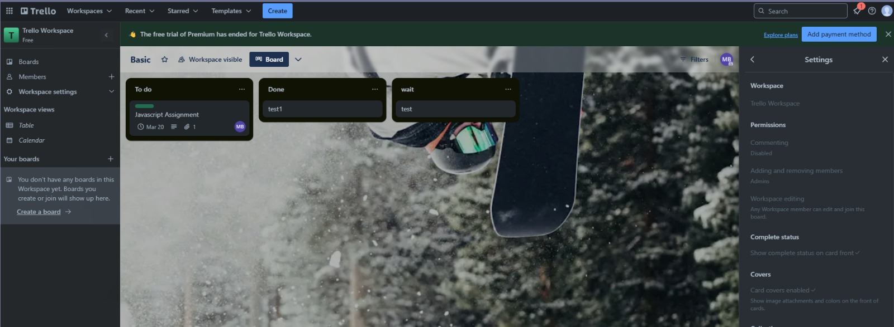
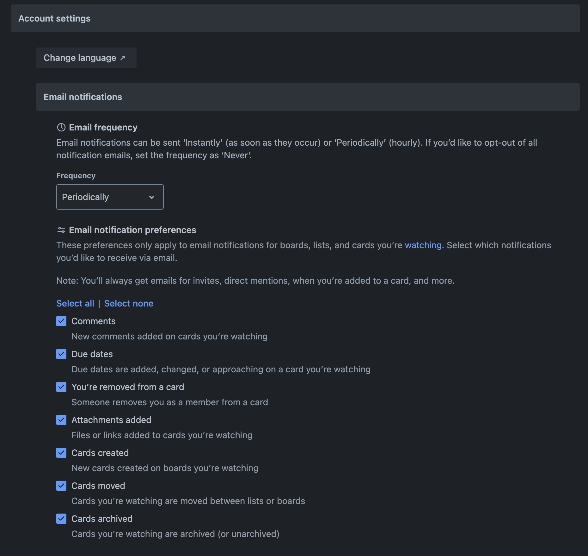

# Troubleshooting Guide  

This troubleshooting guide provides solutions to common issues users may face while using Trello.

---

## **1. I Can’t Create a New Board**  

### 🔹 **Possible Cause:**  
- You have reached the limit for free Trello boards.
- Trello is experiencing a temporary outage.

### ✅ **Solution:**  
1. Check if you are on the **free plan**, which limits boards to **10 per workspace**.  
2. Delete unused boards or upgrade to **Trello Premium**.  
3. Visit [Trello Status](https://trello.status.atlassian.com/) to check if the site is down.  

*Error message when exceeding the board limit in Trello.*  

---

## **2. My Cards Are Not Moving Between Lists**  

### 🔹 **Possible Cause:**  
- Drag-and-drop functionality may be **blocked by browser extensions**.  
- The board might be **in read-only mode**.  

### ✅ **Solution:**  
1. **Try a different browser** or **disable extensions** like ad blockers.  
2. **Refresh** the page or log out and log back in.  
3. Check with the **board admin** to ensure you have editing permissions.  

*Trello's drag-and-drop feature not working due to read-only mode.*  

!!! warning "If a board is in "View Only" mode, you won’t be able to move cards."  

---

## **3. Notifications Are Not Showing Up**  

### 🔹 **Possible Cause:**  
- Trello notifications are **disabled in settings**.  
- Your email provider is filtering Trello emails as **spam**.  

### ✅ **Solution:**  
1. Go to **Settings > Notifications** and enable **desktop and email notifications**.  
2. Check your **spam/junk folder** for Trello emails.  
3. Add **notifications@trello.com** to your email safe list.  

*How to enable notifications in Trello settings.*  

!!! tip "You can manually check notifications in **Trello’s bell icon (🔔) at the top-right corner**."

---
